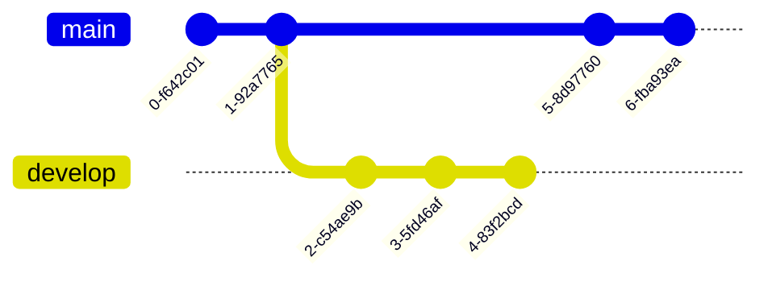

    

    
<h3 align="center">Credit Funding Service</h3>

## Healthiness

## Maturity

```mermaid
gitGraph
       commit
       commit
       branch develop
       commit
       commit
       commit
       checkout main
       commit
       commit
```

## About the project

- This is the project responsible for funding credit operations
